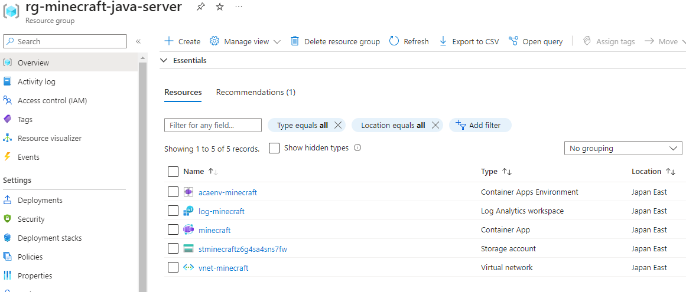
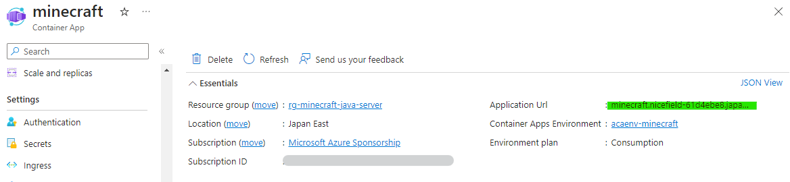
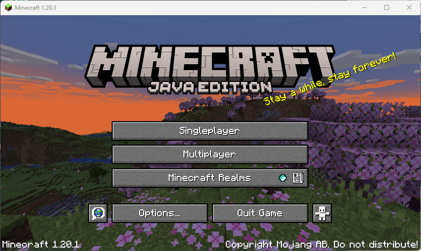
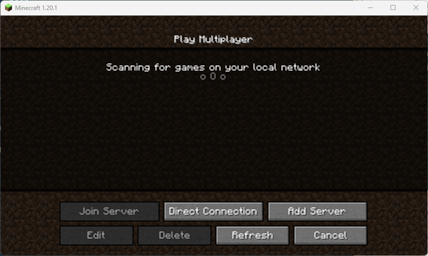
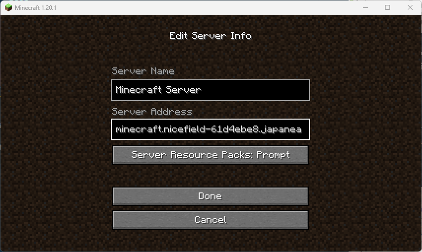
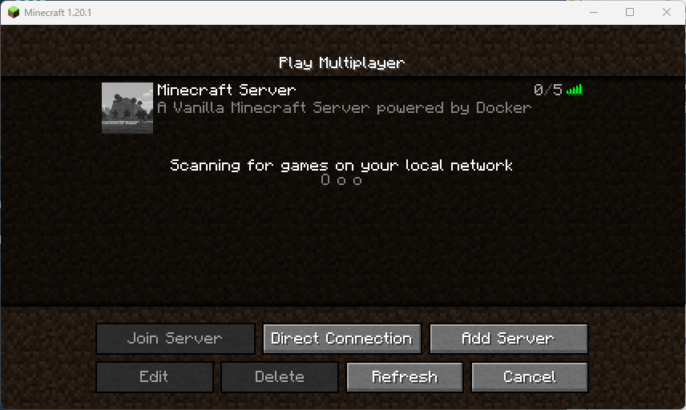
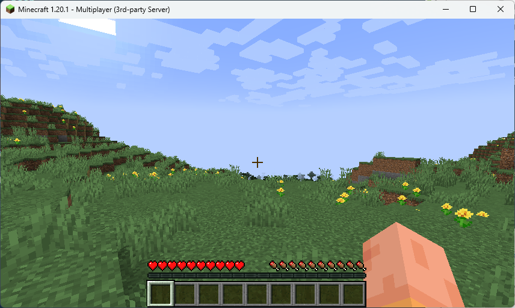

# Azure Container App for Minecraft Java Edition Server

## はじめに

このリポジトリは、Azure Container App上でMinecraft Java Edition Serverのコンテナを動かすためのリソースデプロイファイル一式です。

自身のAzureサブスクリプション上に簡単にデプロイして利用する事ができます。

## 特徴

### Azure関連

- Azure Bicepテンプレートによる実装
- Bicepにパラメータを渡す方式にBicep 0.18.4から追加された「bicepparam」を採用
- Minecraftのワールドデータの保存にはContainer AppからAzure File Storageをマウントして永続化
- Container AppとFile StorageはVirtual Network内から安全に接続
- デプロイパラメータの変更によりMinecraft Serverがアイドル中にはインスタンスを停止して課金を抑える事が可能

### Minecraft Server関連

- Minecraft Java Edition Serverの最新Versionを利用可能
- Minecraftのコンテナイメージはitzg氏のdocker-minecraft-serverを使用  
  [https://docker-minecraft-server.readthedocs.io/en/latest/](https://docker-minecraft-server.readthedocs.io/en/latest/)

## 利用環境

以下の環境でデプロイ確認をしています。

- Ubuntu 22.04 LTS
- Azure CLI 2.50.0 (Azure Bicep 0.19.5)

## ファイルの説明

### mc.sh

Azure CLIにてデプロイテンプレートとパラメータをAzureに渡して各種リソースをデプロイします。

ファイル中の以下の行を変更することで、リソースグループ名とデプロイするリージョンを指定できます。

```sh
rg='rg-minecraft-java-server'
loc='japaneast'
```

### mc.bicepparam

各種Azureリソースと、Minecraft Java Serverに渡す環境変数を指定します。

Container Appの性能は以下のパラメータで調整します。

cpu, memoryの組み合わせはAzureの制限により自由な組み合わせは不可です。

cpu:2.0 の場合は memory:4Gi を指定する必要があります。

```bicep
param cpu = '1.0'
param memory = '2.0Gi'
```

minReplicasはContainer Appの最小数です。

こちらは0か1が指定可能で、0を指定するとMinecraftへの接続が無い状態が一定時間続くと自動的にContainer Appが終了してAzureの課金を抑えることが出来ます。

一度Container Appが終了してもゲームデータはAzure File Storageに保存されているため失われることはありませんが、次回のサーバ接続時には起動に少し時間がかかります。

```bicep
param minReplicas = 1
```

envはMinecraft Java Serverに渡す環境変数です。

EULA, UID, GIDの値は変更しないでください。

その他のパラメータについては、以下URLを参照してください。

[https://github.com/itzg/docker-minecraft-server/blob/master/docs/configuration/server-properties.md](https://github.com/itzg/docker-minecraft-server/blob/master/docs/configuration/server-properties.md)

```bicep
param env = [
  {
    name: 'EULA'
    value: 'TRUE'
  }
  {
    name: 'UID'
    value: '0'
  }
  {
    name: 'GID'
    value: '0'
  }
  {
    name: 'MAX_PLAYERS'
    value: '5'
  }
  {
    name: 'MODE'
    value: 'survival'
  }
  {
    name: 'DIFFICULTY'
    value: 'normal'
  }
]
```

### mc.bicep

Azureリソースをデプロイするためのテンプレートファイルです。

基本的にこのファイルの変更は不要と思いますが、Azure Bicepを始めたばかりの方などには参考になりそうな情報も含まれているため、必要に応じて参照してください。

Container AppからFile Storageの利用は現時点ではプレビューとなっています。

File Storageのアカウント認証が現時点ではStorage Keyのみとなっており、Microsoft Entra ID(AAD)による認証が行えません。

セキュリティ向上の一環として、Container App EnvironmentをVirtual Network内に配置して、File StorageへのアクセスはService Endpointを使っています。

これにより、File Storageをインターネット上に晒すことなく安全に利用しています。

## デプロイ方法

事前にお使いのAzure Subscriptionにサインインしておきます。

```sh
az login -t <テナント名 or テナントID>
az account set -s <サブスクリプションID>
```

後はmc.shを実行します。

```sh
./mc.sh
```

暫く待つと必要なAzureリソースが作成されます。



PC側からMinecraft Serverに接続する際のFQDNは「minecraft」リソースの概要ブレードから確認するか、mc.sh実行後に出力される結果から以下の行を探して確認します。

```json
    "outputs": {
      "minecraftServerAddress": {
        "type": "String",
        "value": "minecraft.nicefield-61d4ebe8.japaneast.azurecontainerapps.io"
      }
    },
```



## Minecraft Serverへの接続方法

PC側からMinecraft Java Editionを起動します。

「Multiplayer」をクリックします。



「Add Server」をクリックします。



「Server Address」に先ほど控えたContainer AppのFQDNを入力してから、「Done」をクリックします。



一覧に追加されたサーバのアイコン部分をクリックして接続します。



無事Minecraft Serverに繋がりゲームが楽しめます。



## おわりに

Docker環境で簡単にMinecraft Serverが利用できるContainer imageを提供してくれている [Geoff Bourne](https://github.com/itzg)氏に感謝します。

また、個人的にはMinecraftはBedrock Editionで遊んでいるので、本当はこちらを利用したかったです。

しかし、現時点ではContainer AppはIngressにUDPが利用出来ないためJava Editionでまずはお試ししました。

本Repositoryに対するIssueやPRも大歓迎です。
