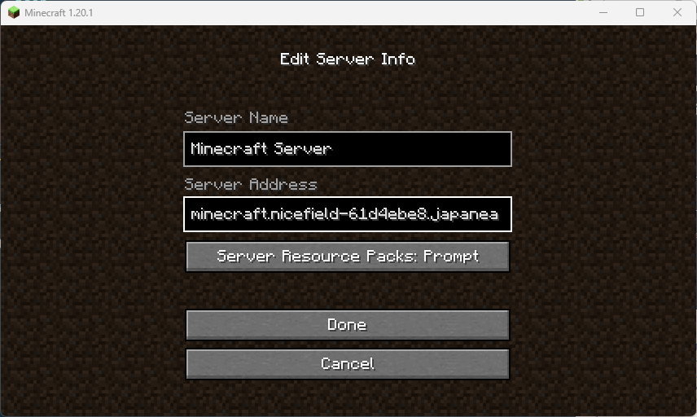
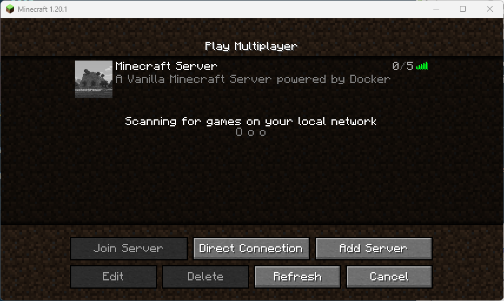

# Azure Container App for Minecraft Java Edition Server

## Introduction

This repository contains a set of resource deployment files for running a Minecraft Java Edition Server container on Azure Container App.

These files can be easily deployed and used on your own Azure subscription.

## Features

### Azure-related

- Implementation with Azure Bicep templates
- The "bicepparam" added to Bicep 0.18.4 is used to pass parameters to Bicep.
- Save Minecraft world data by mounting Azure File Storage from the Container App for persistence.
- Container App and File Storage are securely connected from within the Virtual Network.
- By changing the deployment parameters, it is possible to stop instances while the Minecraft Server is idle and reduce billing.

### Minecraft Server-related

- The latest Version of Minecraft Java Edition Server is available.
- Minecraft container images use Geoffrey Bourne's docker-minecraft-server (https://docker-minecraft-server.readthedocs.io/en/latest/).

## Operating Environment

The deployment has been confirmed under the following environment:

- Ubuntu 22.04 LTS
- Azure CLI 2.50.0 (Azure Bicep 0.19.5)

## File Description

### mc.sh

Passes the deployment template and parameters to Azure via Azure CLI to deploy various resources.

You can specify the resource group name and region to deploy by changing the following line in the file:

```sh
rg='rg-minecraft-java-server'
loc='japaneast'
```

### mc.bicepparam

Specifies various Azure resources and environment variables to pass to Minecraft Java Server.

The performance of the Container App is adjusted with the following parameters.

Combining CPU and memory is not freeform due to Azure restrictions.

If cpu:2.0 is specified, memory:4Gi must be specified.

```bicep
param cpu = '1.0'
param memory = '2.0Gi'
```

minReplicas is the minimum number of Container Apps.

Here you can specify either 0 or 1. If you specify 0, the Container App will automatically shut down and reduce Azure billing when there is no connection to Minecraft for a certain period of time.

Even if the Container App shuts down, the game data is saved in Azure File Storage and will not be lost, but it takes a little longer to start up when you connect to the server next time.

```bicep
param minReplicas = 1
```

env is an environment variable passed to Minecraft Java Server.

Do not change the values of EULA, UID, and GID.

For other parameters, see the following URL.

[https://github.com/itzg/docker-minecraft-server/blob/master/docs/configuration/server-properties.md]( https://github.com/itzg/docker-minecraft-server/blob/master/docs/configuration/server-properties.md)

```bicep
param env = [
  {
    name: 'EULA'
    value: 'TRUE'
  }
  {
    name: 'UID'
    value: '0'
  }
  {
    name: 'GID'
    value: '0'
  }
  {
    name: 'MAX_PLAYERS'
    value: '5'
  }
  {
    name: 'MODE'
    value: 'survival'
  }
  {
    name: 'DIFFICULTY'
    value: 'normal'
  }
]
```

### mc.bicep

This is a template file for deploying Azure resources.

Basically, I don't think you need to modify this file, but it contains information that may be useful as a reference for those who are new to Azure Bicep, so please refer to it as needed.

File storage usage from the Container App is currently in preview mode.

At present, the account authentication for File Storage is only through a Storage Key, and cannot be authenticated using Microsoft Entra ID (AAD).

For security purposes, the Container App Environment is located within the Virtual Network, and access to File Storage is made using Service Endpoint.

This allows File Storage to be used safely without exposing it to the Internet.

## Deployment Method

Sign in to your Azure Subscription in advance.

```sh
az login -t <tenant name or tenant id>
az account set -s <subscription id>
```

Then run mc.sh.

```sh
./mc.sh
```

After a short while, the necessary Azure resources will be created. 


The FQDN to connect to the Minecraft Server from your PC can be found on the overview blade of the "minecraft" resource, or you can confirm it by finding the following line in the output that is shown after running mc.sh.

```json
    "outputs": {
      "minecraftServerAddress": {
        "type": "String",
        "value": "minecraft.nicefield-61d4ebe8.japaneast.azurecontainerapps.io"
      }
    },
```


## Connecting to the Minecraft Server

Launch Minecraft Java Edition on your PC.

Click "Multiplayer".


Click "Add Server".


Enter the FQDN of the Container App that you recorded earlier in "Server Address", and then click "Done".



Click on the icon portion of the server that has been added to the list to connect.



You have successfully connected to the Minecraft Server and can enjoy the game.


## Conclusion

Thanks to [Geoffrey Bourne](https://github.com/itzg) for providing a container image that makes it easy to use Minecraft Server in a Docker environment.

Personally, I play Minecraft on Bedrock Edition, so I really wanted to use it here.

However, at present, Container App cannot use UDP for Ingress, so I tried Java Edition first.

Issues and PRs against this repository are also welcome.
